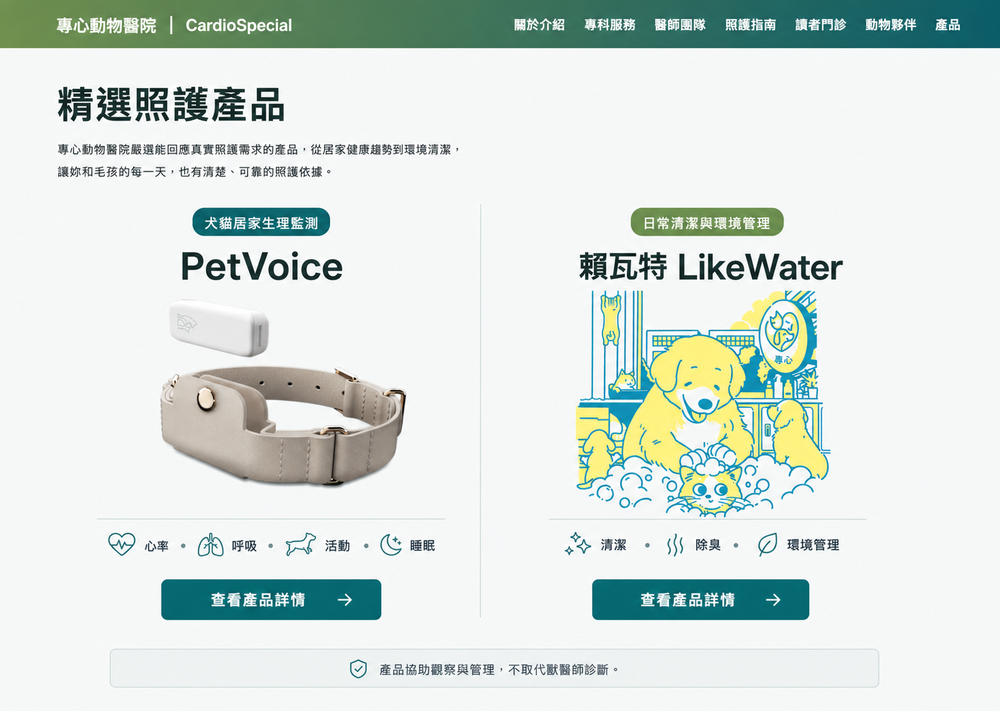

# Products Equal Comparison Redesign

Date: 2026-07-12
Status: Approved visual direction, pending implementation plan

## Objective

Redesign `/products` so PetVoice and 賴瓦特 LikeWater receive equal visual prominence. Visitors should understand the difference between health monitoring and environmental care within the first viewport and reach either product detail page without reading long editorial sections.

The redesign preserves the current brand, content accuracy, routes, navbar, footer, and medical disclaimer. It changes only the presentation and component structure of the product index page.

## Selected Visual Direction

The selected direction is the balanced clinical comparison concept:

The mockup is a visual target rather than a pixel-exact content contract. Existing product facts and approved hospital wording remain authoritative.

## User Outcome

The page should help a dog or cat owner answer three questions quickly:

1. What does each product help with?
2. Which product matches the current care need?
3. Where can I read the complete product information?

Success means both products, their core use cases, and their detail actions are visible and comparable without one product appearing endorsed over the other.

## Information Architecture

### 1. Compact Introduction

- Keep the existing global navbar unchanged.
- Use one H1: `精選照護產品`.
- Use one short supporting paragraph explaining that the products are selected by 專心動物醫院 for real daily care needs.
- Remove the current oversized editorial headline, product count, and duplicate hero actions.
- Do not add a separate phone CTA in the hero; contact options remain in the footer and the product detail pages.

### 2. Equal Product Comparison

The first content section contains two equal columns on desktop. Both columns use the same grid, spacing, image slot, text hierarchy, facts, and CTA dimensions.

PetVoice:

- Label: `犬貓居家生理監測`
- Product name: `PetVoice`
- Image: `/imgs/optimized/petvoice.webp`
- Core facts: `心率`, `安靜時呼吸數`, `活動`, `睡眠`
- Route: `/petvoice`

賴瓦特 LikeWater:

- Label: `日常清潔與環境管理`
- Product name: `賴瓦特 LikeWater`
- Image: `/imgs/optimized/laiwate.webp`
- Core facts: `清潔`, `除臭`, `環境管理`
- Route: `/ohtrust`

Each product uses an explicit `查看產品詳情` RouterLink. The full card is not an interactive link, so text selection and keyboard focus remain predictable.

### 3. Shared Medical Boundary

Place one shared reminder immediately below the comparison:

`產品協助觀察與管理，不取代獸醫師診斷。`

This reminder belongs to both products and must not visually attach to only one column.

### 4. Simplified Care Framework

Keep the current three care principles but reduce them to one compact horizontal section:

- 先理解需求
- 建立日常紀錄
- 異常時回到醫療

The existing emergency contact section remains at the bottom but uses a restrained full-width band. It must not compete with the two primary product CTAs.

## Visual System

- Reuse global tokens from `src/theme.css`.
- Primary accent: `#69964A`.
- Secondary accent: `#006B70`.
- Base surfaces: white and cool light neutrals.
- Use the existing brand gradient only in the global navbar or a small accent, not as a large product background.
- Product columns are separated by spacing and one thin divider before adding borders or shadows.
- Corner radius is no greater than 8px.
- Shadows are optional and must remain subtle.
- Use the existing `Noto Sans TC` font stack and letter spacing of `0`.
- Body text remains 15–16px with comfortable line height.
- Headings are strong but must not approach hero-scale typography inside product columns.

## Responsive Behavior

### Desktop: 992px and wider

- Render a 1:1 two-column product comparison.
- Keep equal image slot heights and aligned CTAs.
- Keep both products visible within the first primary content viewport after the navbar.

### Tablet: 768px to 991px

- Retain two columns when at least 720px of content width is available.
- Reduce image height and horizontal padding before reducing text size.
- Allow product fact labels to wrap without changing CTA alignment.

### Mobile: below 768px

- Stack PetVoice and LikeWater vertically.
- Preserve identical component structure and spacing for both products.
- Use a stable image aspect ratio so product loading cannot shift the layout.
- Make each CTA full width with a minimum 44px touch height.
- Remove the desktop central divider and replace it with section spacing plus one horizontal divider.
- No horizontal scrolling, clipped product names, or overlapping labels.

## Component Structure

`Products.vue` owns page-level content and section order. Extract the repeated product presentation to `src/components/products/ProductComparisonCard.vue` so both products share one template, one responsive contract, and one CTA treatment.

The static product data remains a simple array with these fields:

- `label`
- `title`
- `image`
- `alt`
- `description`
- `facts`
- `link`

No API, Firebase query, new route, checkout flow, or pricing state is introduced.

## Accessibility And SEO

- Keep exactly one H1.
- Product names use H2 headings.
- Care principles use H3 headings.
- Keep descriptive image alt text.
- Use semantic `article`, `dl`, and navigation links.
- Ensure visible keyboard focus on both product CTAs.
- Maintain WCAG AA contrast for text and controls.
- Preserve crawlable product summaries and internal links to `/petvoice` and `/ohtrust`.
- Do not hide critical product information inside images.
- Respect `prefers-reduced-motion`; hover effects must not be required to discover content.

## Failure And Loading Behavior

- Product image slots use explicit dimensions and fixed aspect ratios to prevent cumulative layout shift.
- Both product images load eagerly with asynchronous decoding because the compact layout places them in the first primary viewport.
- If an image fails, the product name, use case, facts, and CTA remain visible and usable.
- The page contains no client-side data dependency, so no loading spinner or empty state is needed.

## Verification

Implementation is complete only when all of the following pass:

- `npm run build`
- A focused source check confirms both product routes, one H1, both H2 headings, alt text, and the shared medical reminder.
- Desktop visual check at 1440px width confirms equal column width, image height, and CTA alignment.
- Mobile visual check at 390px width confirms stacked layout, readable text, full-width CTAs, and no horizontal overflow.
- Browser console contains no new errors on `/products`.
- Existing `/petvoice` and `/ohtrust` navigation remains functional.

## Out Of Scope

- Redesigning PetVoice or OHTrust detail pages
- Adding pricing, checkout, reservation, or online ordering
- Changing the navbar, footer, product claims, SEO routes, or global brand palette
- Replacing the approved product images
